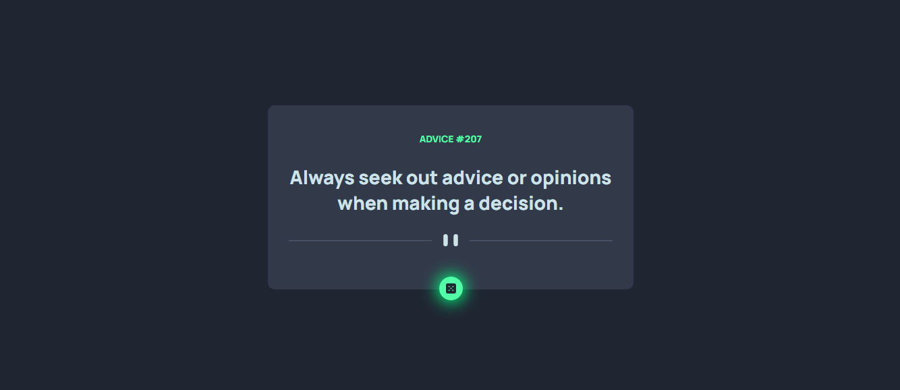

# Country Data App

This is a web application that generates an advice on every button clicked. It was built with REACT, SASS(SCSS)and React Query and react-app-rewire-workbox.

## Table of contents

- [Overview](#overview)
  - [Screenshot](#screenshot)
  - [Link](#link)
  - [Built with](#built-with)

## Overview
This is a web application that generates an advice when the button on the app is clicked. The advice is been fetched from an api. It is also a progressive web application, it can be accessed offline and installed on mobile phones and desktops.

The app was built with:
React- for the user interface
Axios and React Query- for fetching data from the API
SASS(SCSS) modules- for styling the app
React-app-rewire-workbox- for making the app a progressive web app.

### Screenshot

### Link
- Live Site URL: (https://advice-generator-franklynwisdom.vercel.app/)

### Built with

- React
- Axios
- React Query
- SASS(SCSS) modules
- React-app-rewire-workbox
